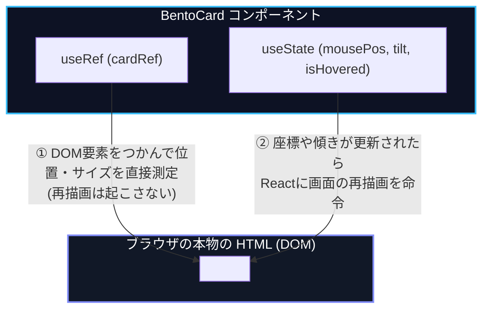
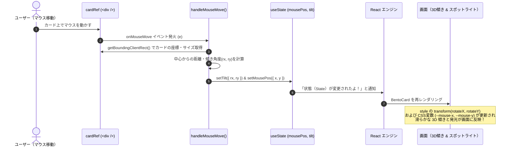
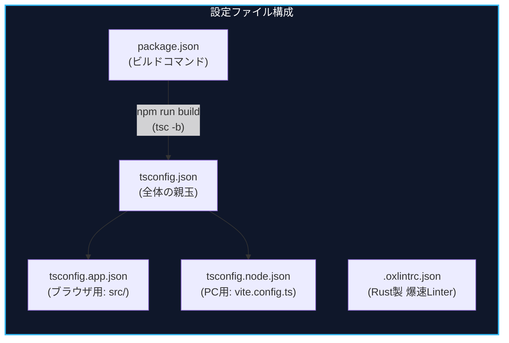
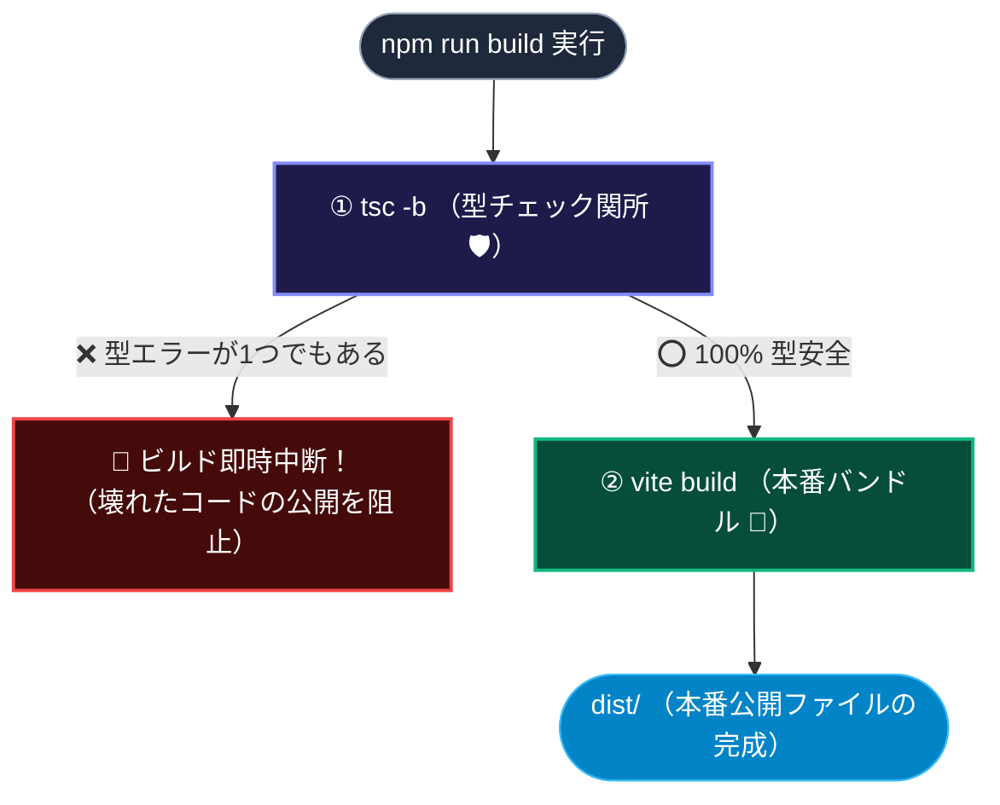

# profile プロジェクト フロントエンド完全解説ガイド

このガイドでは、フロントエンド初心者向けに **ブラウザが画面を描画する順番** に沿って、各ファイルの役割、コードの意味、そして質疑応答で深掘りした技術的背景（ブラウザの仕組み・セキュリティ・Reactの内部動作・CSS設計・TypeScriptの設計思想・アニメーション機構・開発ツールチェーンなど）を体系的にまとめています。

---

## 🗺️ 読み進めロードマップ

1. **`index.html`** ：ブラウザが最初に読み込む土台のHTML ── 【解説完了 ✅】
2. **`src/main.tsx`** ：Reactを起動し、HTMLに差し込む接着剤 ── 【解説完了 ✅】
3. **`src/App.tsx`** ：ページ全体のレイアウト・親コンポーネント ── 【解説完了 ✅】
4. **`src/data/profile.ts`** ：画面に表示するプロフィール・スキル等のデータ ── 【解説完了 ✅】
5. **`src/styles/tokens.css` & `global.css`** ：デザインシステム・スタイル定義 ── 【解説完了 ✅】
6. **`src/components/BentoCard.tsx`** ：3D傾き・発光エフェクトを持つ共通カード基盤 ── 【解説完了 ✅】
7. **開発＆ビルドツール設定（`tsconfig` / `oxlint` / `package.json`）** ── 【解説完了 ✅】

---

# 1. [index.html](../index.html) の解説

ブラウザが `http://localhost:5173` にアクセスしたとき、**一番最初に取得されるHTMLファイル**です。

```html
<!doctype html>
<html lang="ja">

<head>
  <meta charset="UTF-8" />
  <meta name="viewport" content="width=device-width, initial-scale=1.0" />

  <!-- Primary Meta Tags -->
  <title>あにねこらぼ</title>
  <link rel="icon" type="image/svg+xml" href="/favicon.svg" />
  <meta name="description" content="あにねこのプロフィールとポートフォリオサイト" />
  <meta name="theme-color" content="#0b0f19" />

  <!-- Google Fonts -->
  <link rel="preconnect" href="https://fonts.googleapis.com" />
  <link rel="preconnect" href="https://fonts.gstatic.com" crossorigin />
  <link
    href="https://fonts.googleapis.com/css2?family=Inter:wght@300;400;500;600;700&family=JetBrains+Mono:wght@400;500;600&family=Outfit:wght@500;600;700;800&display=swap"
    rel="stylesheet" />
</head>

<body>
  <div id="root"></div>
  <script type="module" src="/src/main.tsx"></script>
</body>

</html>
```

---

## 📚 `index.html` 徹底Q&Aまとめ

### Q1. `<html lang="ja">` を指定しないとどうなる？

- **中華フォント化**: 日本語と共通の漢字（直、返、今、骨など）が中国語（簡体字）フォントで表示され、字形が崩れます。
- **自動翻訳の誤作動**: Chrome等で「このページを日本語に翻訳しますか？」という不要なポップアップが出ます。
- **読み上げの誤読**: スクリーンリーダーが英語エンジンで読もうとして発音が崩れます。

### Q2. `<meta charset="UTF-8" />` を指定しないとどうなる？

- **文字化け**: ブラウザの自動推測が外れ、日本語が `縺薙ｓ縺ｫ縺｡縺ｯ` などに化けます。
- **文字コードXSS攻撃の防止**:
  - *UTF-7攻撃*: サーバーのエスケープをすり抜けた文字列を、ブラウザがUTF-7として解釈して `<script>` を実行させる脆弱性。
  - *マルチバイトすり抜け*: Shift_JIS等の2バイト目（0x5C = `\`）がエスケープ用のバックスラッシュを吸収してしまう問題。
- UTF-8を `<head>` の先頭で明示することで、ブラウザの誤認を100%防ぎます。

### Q3. `<meta name="viewport" content="width=device-width, initial-scale=1.0" />` を書かないと？

- スマホブラウザが「PC向け（横幅980px）」と誤判定し、画面全体が **米粒サイズに縮小表示** されます。
- スマホ用のCSS（メディアクエリ `@media`）が一切反応しなくなります。

### Q4. タグの並び順と favicon の位置は？

- `<meta charset>` と `<meta name="viewport">`（パースと表示の前提条件）を最上部に置きます。
- `<title>` と `<link rel="icon">` は「ブラウザのタブに表示する看板セット」なので、`<title>` の直下に `favicon` を置くのが最も自然で論理的です。

### Q5. `<meta name="title">` は必要？

- **不要です（省略可）**。ブラウザやGoogle検索は標準の `<title>` タグを参照します。SNS共有用には OGP（`<meta property="og:title">`）を使用します。

### Q6. `<meta name="description">` の役割は？

- Google等の検索結果で、タイトルの下に表示される **概要文（スニペット）** になります。指定しないとGoogleが本文から適当に文字を切り抜いて表示してしまいます（80〜120文字が推奨）。

### Q7. `<meta name="theme-color">` とは？

- iPhone (Safari) のステータスバーや Android (Chrome) のアドレスバーの背景色を、サイトの背景色（`#0b0f19`）とシームレスに一体化させ、ネイティブアプリのような没入感を作ります。

### Q8. `rel="preconnect"` でなぜ読み込みが速くなる？

- 通常、Webフォントのダウンロードは描画パイプラインの後半（レンダーツリー構築・ペイント直前）まで後回しにされます。
- `preconnect` を置くことで、**HTML解析（DOMツリー作成）の初期段階でバックグラウンド接続（DNS検索 + TCP接続 + TLS暗号化鍵交換）を先制して完了** させておけます。
- *W3C仕様書 / MDN / Google web.dev* にも「描画プロセスの初期に先制して接続確立を行う（Preemptively perform connection establishment）」と明記されています。

### Q9. `fonts.googleapis.com` と `fonts.gstatic.com` の違い & なぜ 404 になる？

- **`fonts.googleapis.com`**：ユーザーのブラウザに合わせて最適なCSS（`@font-face`）を動的生成する **APIサーバー**。ルート（`/`）にはHTMLがないため直接叩くと404になります。
- **`fonts.gstatic.com`**：フォント本体（`.woff2` ファイル）を超高速配信する静的CDNサーバー。

### Q10. `crossorigin` はなぜ必要？

- Webフォント（`.woff2`）は仕様上、必ず **CORS（クロスオリジン通信）** で取得する必要があります。
- `crossorigin` を付けないと、ブラウザは通常通信用の部屋で事前接続してしまい、後からフォントを落とす際にその回線を再利用できず無駄になってしまいます。

### Q11. なぜ `<body>` ではなく `<div id="root"></div>` にマウントするのか？

- ブラウザ拡張機能（パスワード管理、翻訳ツールなど）や外部スクリプトは `<body>` 直下にタグを勝手に差し込んできます。
- `<body>` 自体をReactの管理下に置くと、ReactがDOM更新時に「知らないタグがある！」とパニックを起こし、`removeChild` エラーで **画面が真っ白にクラッシュ** します。独立したコンテナ `<div id="root">` で隔離することが必須です。

---

# 2. [src/main.tsx](../src/main.tsx) の解説

`index.html` から呼び出される、**TypeScript / React のエントリーポイント（開始地点）**です。

```tsx
import { StrictMode } from 'react'
import { createRoot } from 'react-dom/client'
import './index.css'
import App from './App.tsx'

createRoot(document.getElementById('root')!).render(
  <StrictMode>
    <App />
  </StrictMode>,
)
```

---

## 📚 `src/main.tsx` 徹底Q&Aまとめ

### Q1. `.tsx` とは？ なぜ `.ts` や `.js` と分かれている？

- **`.js`**: 通常のJavaScript
- **`.jsx`**: JavaScript + JSX（HTML風の構文）
- **`.ts`**: TypeScript（型が使えるJS）
- **`.tsx`**: **TypeScript + JSX（型が使えて、HTML風のUIも書けるReact標準の形式）**
- 開発時は Vite がメモリ上で一瞬で `.js` に変換し、本番ビルド時は `dist/assets/index-[hash].js` にバンドルされます。

### Q2. `import './index.css'` とは？

- 通常のJSではCSSをimportできませんが、Viteがこれを解釈して **HTMLの `<head>` に自動注入** します。
- 共通リセットCSS、カラー変数（Tokens）、フォント設定がアプリ起動と同時に一括適用されます。開発中は保存と同時にリロード不要でデザインが変わる **HMR（Hot Module Replacement）** が効きます。

### Q3. `StrictMode`（厳格モード）とは？

- **開発時専用のバグ検出アシスタント**（本番ビルドでは完全無効化・負荷ゼロ）。
- **コンポーネントをあえて2回実行** することで、タイマーやイベントリスナーの解除忘れ（メモリリーク）や、予期せぬ副作用（グローバル変数の書き換えバグなど）をあぶり出します。
- 開発中に `console.log` が2回出るのは、この `StrictMode` が正常に仕事をしている証拠です。

### Q4. `createRoot` とは？ 無いとどうなる？ 必須？

- **現代のReact（React 18 / 19）では「完全な必須API」** です。
- **処理内容**:
  1. `<div id="root">` を受け取ってReact管理拠点（Root）を作成
  2. 最新の高速化エンジン（並行レンダリング機能）を有効化
  3. `.render(<App />)` で仮想DOMを実際のHTMLタグに変換して `<div id="root">` に差し込む（マウント）。
- **無い場合**: 画面は完全に **真っ白** になります（HTMLとReactが接続されないため）。

### Q5. `document.getElementById('root')!` の `!` とは？

- TypeScriptの **Non-null assertion（非null表明）** 記号です。
- 「`<div id="root">` は `index.html` に絶対に存在するから、nullチェックのエラーを出さなくて大丈夫！」とコンパイラに伝えています。

---

# 3. [src/App.tsx](../src/App.tsx) の解説

アプリケーション全体の **「司令塔（親玉コンポーネント）」** です。
各子コンポーネントを読み込み、ページ全体のレイアウト（Bento Grid）を組み立てます。

### 📄 ソースコード

```tsx
import React from 'react';
import { BackgroundEffect } from './components/BackgroundEffect';
import { Navbar } from './components/Navbar';
import { HeroCard } from './components/HeroCard';
import { AboutCard } from './components/AboutCard';
import { TechStackCard } from './components/TechStackCard';
import { ProjectsCard } from './components/ProjectsCard';
import { Footer } from './components/Footer';
import './App.css';

export const App: React.FC = () => {
  return (
    <div className="app-root">
      {/* Dynamic Aurora & Grid Ambient Background */}
      <BackgroundEffect />

      {/* Floating Navbar */}
      <Navbar />

      {/* Main Bento Grid Content */}
      <main className="container">
        <div className="bento-grid-layout">
          {/* Hero Section */}
          <HeroCard />

          {/* Philosophy / About Highlights */}
          <AboutCard />

          {/* Tech Stack & Skills */}
          <TechStackCard />

          {/* Projects / Works Showcase */}
          <ProjectsCard />
        </div>
      </main>

      {/* Footer */}
      <Footer />
    </div>
  );
};

export default App;
```

---

## 📚 `src/App.tsx` 徹底Q&Aまとめ

### Q1. UIの階層構造（コンポーネントツリー）はどうなっている？

```
<div className="app-root">
 │
 ├── ① <BackgroundEffect />    （最背面のオーロラ＆グリッド発光背景）
 ├── ② <Navbar />              （画面上部に浮かぶフローティングヘッダー）
 │
 ├── ③ <main className="container">
 │      └── <div className="bento-grid-layout">  （Bento Grid レイアウト）
 │            ├── <HeroCard />         （アバター・ステータス・自己紹介）
 │            ├── <AboutCard />        （フォーカス・マインドセット・経歴）
 │            ├── <TechStackCard />    （スキルタグ・習熟度バッジ）
 │            └── <ProjectsCard />     （個人開発・制作物一覧）
 │
 └── ④ <Footer />              （最下部のコピーライト）
```

### Q2. `export const App: React.FC = () => {}` の意味・必須/任意は？

- **構文の分解**:
  - `export`: 他のファイル（`main.tsx`）から読み込めるよう公開
  - `const App`: 変数（定数）宣言
  - `: React.FC`: `React.FunctionComponent` の略（型注釈）
  - `= () => {}`: UI（仮想DOM）を返すアロー関数
- **必須か？任意か？**:
  - `App` 関数自体は **必須**（描画するUI本体のため）。
  - `: React.FC` という型注釈は **任意（省略可）**。省略してもTypeScriptが自動型推論してくれます（`export const App = () => {}` や `export function App() {}` も主流）。
- **内部挙動**:
  `main.tsx` の `.render(<App />)` 時にReactが `App()` 関数を実行し、返されたJSX（仮想DOM設計図）を元に実HTMLを構築します。

### Q3. `className="app-root"` の役割・無いとどうなる？

- **なぜ `class` ではなく `className`？**:
  JavaScriptの予約語 `class` との衝突を避けるため。Reactが実DOMに変換する際に自動で `class="app-root"` になります。
- **当たっているCSS（`App.css`）の4大機能**:
  1. `min-height: 100vh`: 画面全体の高さを最低100%確保
  2. `display: flex; flex-direction: column;`: ヘッダー・メイン・フッターを縦並びに綺麗に配置
  3. `position: relative`: 背面の `<BackgroundEffect />` などの絶対配置の基準アンカー
- **無いとどうなる？**:
  コンテンツが少ない場合に **フッターが画面中央付近に浮き上がってしまったり**、背景エフェクトの位置がずれたりします（デザイン上実質必須）。

---

# 4. [src/data/profile.ts](../src/data/profile.ts) の解説

Webサイトに表示するすべての情報（名前、自己紹介、SNSリンク、スキル、制作実績など）を一元管理している **「データ層（マスターデータ）」** です。
前半の **型定義（TypeScriptのインターフェース）** と後半の **データ本体** に分かれています。

### 📄 ソースコード（抜粋）

```typescript
// 前半：型定義（データの設計図）
export interface SocialLink {
  name: string;
  url: string;
  icon: 'github' | 'twitter' | 'mail' | 'blog' | 'zenn' | 'qiita' | 'external';
  label: string;
  handle?: string; // ? は省略可能（オプショナル）
}

export interface ProfileData {
  name: string;
  role: string;
  avatar: string;
  location: string;
  status: { available: boolean; label: string; };
  headline: string;
  bio: string[];
  socialLinks: SocialLink[];
  skillCategories: SkillCategory[];
  featuredProjects: ProjectItem[];
  timeline: TimelineItem[];
  highlights: { label: string; value: string; description: string; }[];
}

// 後半：実際のデータ本体
export const profileData: ProfileData = {
  name: "anineko",
  role: "Software Engineer",
  avatar: "https://images.unsplash.com/...",
  location: "Tokyo, Japan",
  status: {
    available: true,
    label: "Open to new projects & tech talks",
  },
  headline: "Crafting modern web experiences & building robust developer tools.",
  bio: [
    "Webフロントエンドからクラウド・自動化まで...",
    "個人開発や技術検証、開発環境の自動化に情熱を注いでいます。"
  ],
  socialLinks: [ ... ],
  highlights: [ ... ],
  skillCategories: [ ... ],
  featuredProjects: [ ... ],
  timeline: [ ... ]
};
```

---

## 📚 `src/data/profile.ts` 徹底Q&Aまとめ

### Q1. `handle?: string` の `?` はどういう意味？

- **オプショナル（省略可能）プロパティ** を表すTypeScriptの記号です。
- GitHubやXには `@anineko280` のようなアカウント名がありますが、一般ブログやWebサイトのリンクにはアカウント名が存在しない場合があります。
- `?` を付けることで「あってもいいし、無くても（省略しても）エラーにしない」という柔軟なデータ構造を定義できます。

### Q2. なぜ型と実際のデータを一緒に定義せず、分けて書くのか？

1. **子コンポーネントで「部品ごとの型」を再利用できる**:
   `ProjectsCard.tsx` でプロジェクト1件分の型（`ProjectItem`）だけを直接 `import { ProjectItem }` して使えます。
2. **データ入力時のサジェスト（入力補完）**:
   先に型を定義しておくことで、データを書く際にエディタが選べるアイコン名（`'github' | 'twitter'` など）を自動提案し、タイポを防ぎます。
3. **自己文書化（ドキュメント性）**:
   ファイルを開いた瞬間、上部の `interface` を見るだけでデータ全体の構造が5秒で把握できます。

### Q3. PHP/Javaの `private string $hoge = 'fuga'` のように型とデータを一緒に書かないのはなぜ？（TypeScriptの設計思想）

- **構造的型付け（Structural Typing）**:
  Javaなどの「クラスのインスタンスしか型と認めない（公称型）」と異なり、TypeScriptは「形（プロパティ）さえ合っていればOK」という柔軟な思想を持っています。クラスを `new` せずプレーンなオブジェクト `{}` をそのまま型安全に扱えます。
- **Web（JSON）との親和性**:
  Web開発ではサーバーからJSON（辞書データ）を受け取るのが基本です。クラスよりも `interface` ＋ プレーンオブジェクトの方が、JSONデータにそのまま型をかぶせるだけで扱えるため圧倒的に合理的です。
- **Reactの関数型思想**:
  Reactは「状態やメソッドを持つクラス」よりも、「純粋なデータ（Props）」と「それを受け取ってHTMLを返す関数」を好みます。

---

# 5. [src/styles/tokens.css](../src/styles/tokens.css) & [src/styles/global.css](../src/styles/global.css) の解説

サイト全体の **「デザインシステム（デザイントークン）」** と **「共通スタイル・アニメーション」** を司る2つのファイルです。

### 📄 ソースコード（抜粋）

```css
/* tokens.css: デザイントークン（定数集） */
:root {
  --bg-primary: #070913;
  --bg-card: rgba(17, 24, 43, 0.65);
  --accent-cyan: #38bdf8;
  --accent-indigo: #818cf8;
  --glass-blur: blur(16px);
  --grad-primary: linear-gradient(135deg, #38bdf8 0%, #818cf8 50%, #c084fc 100%);
  --font-sans: 'Inter', -apple-system, sans-serif;
  --radius-md: 14px;
}

/* global.css: 共通ルール & ユーティリティ */
@import './tokens.css';

*, *::before, *::after {
  box-sizing: border-box;
  margin: 0;
  padding: 0;
}

html {
  -webkit-font-smoothing: antialiased;
  -moz-osx-font-smoothing: grayscale;
}

::-webkit-scrollbar { width: 8px; }
::-webkit-scrollbar-thumb {
  background: rgba(255, 255, 255, 0.15);
  border-radius: var(--radius-full);
}
::-webkit-scrollbar-thumb:hover { background: rgba(99, 102, 241, 0.5); }
```

---

## 📚 `tokens.css` & `global.css` 徹底Q&Aまとめ

### Q1. `tokens.css` のように定数集を作るのは定番？（デザイントークンの思想）

- **完全な業界標準（超定番）** です（Google, Apple, Figma, Tailwind CSS などもすべてこの思想）。
- **4大メリット**:
  1. *デザインの一貫性*: 全員が `var(--accent-indigo)` を使うことで色のバラツキを防止。
  2. *テーマ切り替え（ダーク/ライト）*: `:root` の定数を差し替えるだけで画面全体の色が一瞬で反転。
  3. *ブランド変更の爆速化*: `tokens.css` の1行を変えるだけでサイト全体に即時反映。
  4. *Figmaとの共通言語化*: デザイナーとエンジニアが同じ変数名で会話可能。

### Q2. `-webkit-font-smoothing: antialiased;` とは？ なぜダークモードで必須？

- macOSやiOSで、フォントのレンダリング方式を「グレースケール・アンチエイリアス」に切り替える設定です。
- デフォルトのMacでは、黒背景に白文字を描画すると **白文字の輪郭がボテッと太く滲んで見えてしまう現象** が起きます。`antialiased` を指定することで、細身でクッキリと引き締まった高級感のある文字になります。

### Q3. `webkit` とは？

- Appleが開発している **SafariやiOSブラウザの描画エンジン（HTML/CSSを画面に描画する心臓部）** です（Google Chromeのエンジン「Blink」もWebKitから派生）。
- `-webkit-` という接頭辞（ベンダープレフィックス）をつけることで、WebKit/Blink系ブラウザに向けた専用の高度な描画命令（フォントのスッキリ化、スクロールバーのカスタマイズなど）を実行できます。

### Q4. `::-webkit-scrollbar` とは？

- ブラウザのスクロールバーをサイトのテーマ（ダークグラスモーフィズム）に合わせてカスタマイズする疑似要素です。
- レール（track）を背景色と同化させ、つまみ（thumb）を半透明・角丸にし、ホバー時には紫色に発光させることで、細部まで統一感のあるデザインに仕上げています。

### Q5. `:`（コロン1つ）と `::`（コロン2つ）の違いは？

- **`:`（コロン1つ = 疑似クラス）**: 要素の **「状態（State）」** を表す（例: `:hover` マウスが乗ったとき、`:focus` 入力中）。
- **`::`（コロン2つ = 疑似要素）**: 要素の **「特定の部分（パーツ）」** を表す（例: `::before` 前のパーツ、`::-webkit-scrollbar` スクロールバー部分、`::selection` 選択したテキスト部分）。

### Q6. `@keyframes` とは？ なぜGPUで速く動く？

- CSSで **アニメーションの絵コンテ（タイムライン・コマ割り）** を定義する構文です（0%〜100%の動きを指定）。
- JavaScriptではなくCSSの `@keyframes` で `transform`（移動・回転）や `opacity`（透明度）を動かすと、ブラウザが **GPU（グラフィックボード）で直接レンダリング** するため、低スペック端末でもカクつかず 60fps〜120fps の滑らかな動きを維持できます。

---

# 6. [src/components/BentoCard.tsx](../src/components/BentoCard.tsx) & [BentoCard.css](../src/components/BentoCard.css) の解説

すべてのカードの共通土台となる **「最先端のリッチUIカード基盤」** です。
マウスを乗せると **3D立体ティルト（傾き）** し、カーソル位置に合わせて **スポットライト発光** します。

### 📄 ソースコード

```tsx
import React, { useRef, useState } from 'react';
import './BentoCard.css';

interface BentoCardProps {
  children: React.ReactNode;
  className?: string;
  colSpan?: 1 | 2 | 3 | 4;
  rowSpan?: 1 | 2;
  enableTilt?: boolean;
  glowColor?: 'indigo' | 'cyan' | 'purple' | 'emerald' | 'amber';
  id?: string;
}

export const BentoCard: React.FC<BentoCardProps> = ({
  children,
  className = '',
  colSpan = 1,
  rowSpan = 1,
  enableTilt = true,
  glowColor = 'indigo',
  id,
}) => {
  const cardRef = useRef<HTMLDivElement>(null);
  const [mousePos, setMousePos] = useState({ x: 0, y: 0 });
  const [tilt, setTilt] = useState({ rx: 0, ry: 0 });
  const [isHovered, setIsHovered] = useState(false);

  const handleMouseMove = (e: React.MouseEvent<HTMLDivElement>) => {
    if (!cardRef.current) return;
    const rect = cardRef.current.getBoundingClientRect();
    const x = e.clientX - rect.left;
    const y = e.clientY - rect.top;
    setMousePos({ x, y });

    if (enableTilt) {
      const centerX = rect.width / 2;
      const centerY = rect.height / 2;
      const rx = ((y - centerY) / centerY) * -6;
      const ry = ((x - centerX) / centerX) * 6;
      setTilt({ rx, ry });
    }
  };

  const handleMouseEnter = () => setIsHovered(true);
  const handleMouseLeave = () => {
    setIsHovered(false);
    setTilt({ rx: 0, ry: 0 });
  };

  return (
    <div
      ref={cardRef}
      id={id}
      className={`bento-card col-span-${colSpan} row-span-${rowSpan} glow-${glowColor} ${className}`}
      onMouseMove={handleMouseMove}
      onMouseEnter={handleMouseEnter}
      onMouseLeave={handleMouseLeave}
      style={{
        transform: isHovered && enableTilt
          ? `perspective(1000px) rotateX(${tilt.rx}deg) rotateY(${tilt.ry}deg) translateZ(4px)`
          : 'perspective(1000px) rotateX(0deg) rotateY(0deg) translateZ(0px)',
        ['--mouse-x' as any]: `${mousePos.x}px`,
        ['--mouse-y' as any]: `${mousePos.y}px`,
      }}
    >
      <div className="bento-spotlight" />
      <div className="bento-border" />
      <div className="bento-content">
        {children}
      </div>
    </div>
  );
};
```

---

## 📚 `BentoCard.tsx` 徹底Q&Aまとめ

### Q1. `useRef` とは？ なぜ `document.getElementById` ではない？

- **`useRef` の役割**: Reactコンポーネント自身がブラウザの本物のHTML要素（DOM）を直接つかむためのフック。
- **カード位置・サイズの測定**: `cardRef.current.getBoundingClientRect()` でカードの画面上の座標を取得し、マウス位置を正確に計算。
- **なぜ `getElementById` ではないのか？**: 画面上に `<BentoCard>` が4枚あるため、ID検索だと他のカードと衝突してしまいます。`useRef` なら「今触っているまさにその1枚」を確実に特定できます。

### Q2. `useState` とは？ なぜ普通の変数 `let` ではダメ？

- **`useState` の役割**: 画面の見た目を変えるデータ（状態）を保持し、更新時に画面を自動再描画させるフック。
- **なぜ `let` ではダメなのか？**: `let isHovered = true` のように普通の変数を書き換えても React は検知できません。`setIsHovered(true)` を呼ぶことで React に「画面を描き直して！」と通知が届きます。

### Q3. `useState` と `useRef` の違い（Mermaid 図解）



### Q4. 3D ティルト（傾き）とスポットライト発光の連動サイクル（Mermaid シーケンス図）



### Q5. `React.FC<BentoCardProps>` とは？ ジェネリクスを使わない場合どうなる？

- **構文の分解**:
  - `React.FC`: Reactの関数コンポーネント型
  - `<BentoCardProps>`: **ジェネリクス（型引数）**。コンポーネントに対して「受け取る引数は `BentoCardProps` のルールにしてね」と型を注入しています。
- **ジェネリクスを省略するとどうなる？**:
  `React.FC` だけで `<...>` を書かないと「引数なしのコンポーネント `{}`」とみなされ、`colSpan` や `glowColor` を受け取ろうとすると TypeScript コンパイルエラーになります。
- **ジェネリクスを使わない代替構文**:
  `export const BentoCard = ({ children, colSpan = 1 }: BentoCardProps) => { ... }` のように引数側に直接型注釈をつける書き方もモダンReactで広く使われています。

### Q6. CSSはなぜ別ファイル？ CSS-in-JS は使わないの？

- **CSS-in-JS（styled-components等）の歴史と課題**:
  2018〜2021年に大流行しましたが、JS実行時に動的に `<style>` タグを生成するため「動作が重い」「React 18/19のServer Componentsと相性が悪い」ことから現在は下火になっています。
- **現代のベストプラクティス（ハイブリッド設計）**:
  1. *静的スタイル*: `BentoCard.css`（別ファイル）でブラウザのGPUアクセラレーションを最大活用して描画（実行時コストゼロ）。
  2. *動的スタイル*: マウス座標（`--mouse-x`, `--mouse-y`）や3D傾き（`rotateX`, `rotateY`）の数値だけを React から CSS変数 経由で注入。
  この組み合わせが最も高速で滑らかなパフォーマンスを発揮します。

---

# 7. 開発・ビルド設定（[tsconfig.json](../tsconfig.json) / [.oxlintrc.json](../.oxlintrc.json) / [package.json](../package.json)）の解説

アプリケーションを高速かつ安全に開発・ビルドするための **「開発環境（ツールチェーン）の設定群」** です。



---

## 📚 開発・ビルド設定 徹底Q&Aまとめ

### Q1. `.oxlintrc.json` とは？ なぜ ESLint ではなく Oxlint？

- **Rust製の超高速 Linter**: 従来の ESLint より **50〜100倍高速** に動作し、React のルール違反やタイポをミリ秒で検知します。
- **ルールの要点**:
  - `"react/rules-of-hooks": "error"`: フックを `if` やループ内で呼ぶミスを即座にエラー判定。
  - `"react/only-export-components"`: Vite の超高速リロード（HMR）が壊れないようエクスポートを監視。

### Q2. なぜ `tsconfig` ファイルが 3 つに分かれている？

- **環境の分離（Project References）**:
  1. **`tsconfig.app.json`（ブラウザ用）**: `src/` 配下が対象。`DOM`（`document`, `window`）や JSX（`<div />`）を許可。
  2. **`tsconfig.node.json`（Node.js用）**: `vite.config.ts` が対象。Node.js環境の型（`types: ["node"]`）を許可し、DOMは禁止。
  3. **`tsconfig.json`（親玉）**: 上記2つを束ねて、エディタに全体の型参照を指示。
- **メリット**: ブラウザ用コードに誤って Node.js 専用命令（`fs` 等）が混入してクラッシュするバグを未然に防ぎます。

### Q3. `tsconfig.json` は誰が使っている？ Vite？ エディタ？

- **主な利用者**:
  1. **エディタ（VS Code / IDE）**: コードを書いている最中にリアルタイムで入力候補や赤波線エラーを出すため。
  2. **`tsc` コマンド**: ビルド前に全ファイルの型を一括検査するため。
- **Vite は使わないの？**:
  Vite は爆速動作のために「型チェックを完全にスルーして JS へ変換」するため、型検査には `tsconfig.json` を使いません。

### Q4. `tsc` コマンドはどこで使われている？（ビルドの安全関所）

- `package.json` のビルドスクリプト `"build": "tsc -b && vite build"` で使われています。



- **`tsc -b` の `-b`（`--build`）**: `tsconfig.json` の参照（`references`）をたどり、ブラウザ側とビルド側の両方をまとめて一括検査します。

---

## 💡 全体の処理フローまとめ

```
[ブラウザ]
   │ (1) http://localhost:5173 にアクセス
   ▼
[index.html]
   │ (2) <div id="root"> を用意し、/src/main.tsx を実行
   ▼
[src/main.tsx]
   │ (3) document.getElementById('root') を取得し、
   │     createRoot(...).render(<App />) を実行
   │     同時に import './index.css'（tokens & global.css）を適用
   ▼
[src/App.tsx]
   │ (4) 画面レイアウトを構築し、各セクションを <BentoCard> に包む
   ▼
[src/components/BentoCard.tsx]
   │ (5) 3Dティルト & マウス追従スポットライト基盤を提供
   ▼
[src/data/profile.ts]
   │ (6) 各カード（Hero, About, TechStack, Projects）にデータを提供して描画！
   ▼
[開発・ビルド環境]
   └─ (7) Oxlint / tsconfig / tsc -b が型安全性と品質をバックグラウンドで死守！🛡️
```
